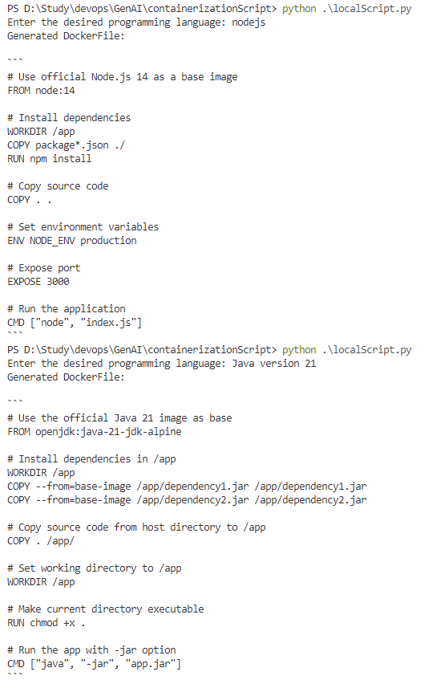

# LLM-Based Containerization

Welcome to the **LLM-Based Containerization** repository! This project leverages **Large Language Models (LLMs)** to generate optimized Dockerfiles for various programming languages, ensuring best practices and efficiency.

##  Features
- **Automated Dockerfile Generation**: Uses `llama3.2:1b` model from `ollama` to generate Dockerfiles dynamically.
- **Best Practices**: Ensures each Dockerfile includes an optimized base image, dependencies installation, workspace setup, and execution commands.
- **Multi-Language Support**: Generate Dockerfiles for different programming languages on demand.

## 📦 Installation

To use this script, you need to have Python installed along with the `ollama` package.

```sh
pip install ollama
```

##  Usage

Run the script and input your desired programming language to generate a Dockerfile.

```sh
python localScript.py
```

### Example:
```
Enter the desired programming language: Python
Generated DockerFile:

FROM python:3.10
WORKDIR /app
COPY . .
RUN pip install -r requirements.txt
CMD ["python", "app.py"]
```

##  Screenshot
Here is a screenshot of a generated Dockerfile:



##  How It Works
1. The script prompts the user to enter a programming language.
2. It passes a structured prompt to the `llama3.2:1b` model using `ollama.chat()`.
3. The model generates an optimized Dockerfile based on best practices.
4. The output is displayed in the console.

##  Requirements
- Python 3.x
- `ollama` package
- Internet connection to interact with the LLM model

##  License
This project is licensed under the MIT License. Feel free to modify and contribute!

##  Contributing
Contributions are welcome! Please submit a pull request or open an issue for suggestions or bug reports.

##  Contact
For any queries or discussions, feel free to reach out via GitHub issues.

---

Happy Containerizing! 🐳

